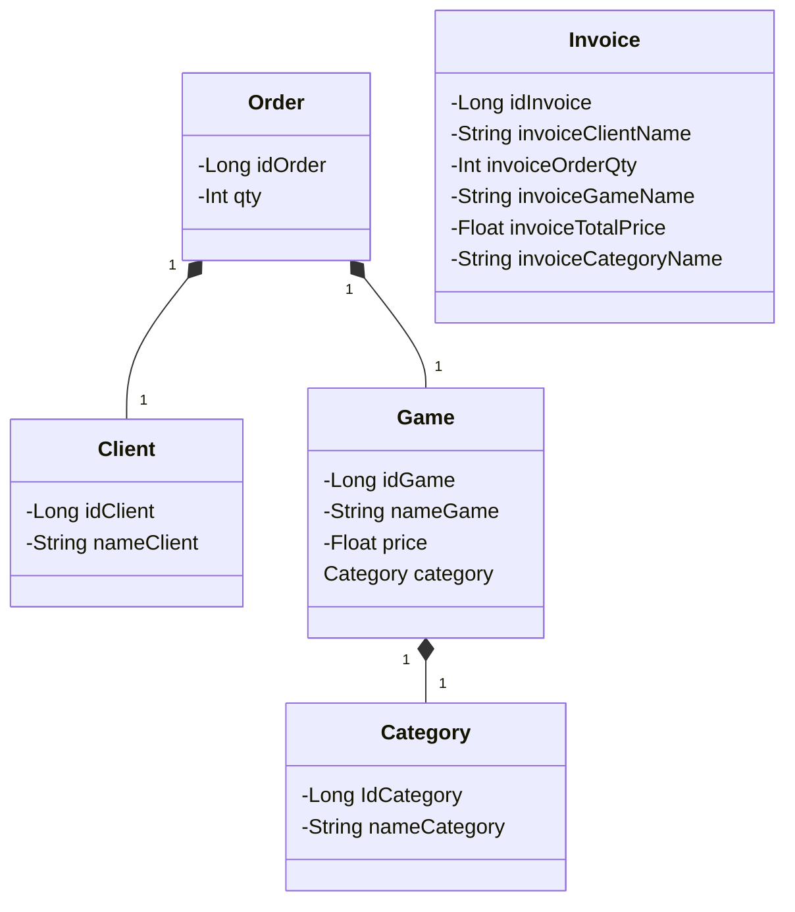

# Java com AI 2024

Java RESTful API.

## Principais Tecnologias
 - **Java 17**: Utilizaremos a versão LTS mais recente do Java para tirar vantagem das últimas inovações que essa linguagem robusta e amplamente utilizada oferece;
 - **Spring Boot 3**: Trabalharemos com a mais nova versão do Spring Boot, que maximiza a produtividade do desenvolvedor por meio de sua poderosa premissa de autoconfiguração;
 - **Spring Data JPA**: Exploraremos como essa ferramenta pode simplificar nossa camada de acesso aos dados, facilitando a integração com bancos de dados SQL;
 - **OpenAPI (Swagger)**: Vamos criar uma documentação de API eficaz e fácil de entender usando a OpenAPI (Swagger), perfeitamente alinhada com a alta produtividade que o Spring Boot oferece;
 - **Railway**: facilita o deploy e monitoramento de nossas soluções na nuvem, além de oferecer diversos bancos de dados como serviço e pipelines de CI/CD.
 
 ## Contruindo um container da sua aplicação
 - **Docker**: Podemos criar uma imagem da aplicação e, juntamente com uma imagem de um Banco de Dados (Postgres), podemos construir também um container do sistema para rodar localmente ou enviar para algum repositório específico, como por exemplo o DockerHub. Instruções de criação dos arquivos do Dockerfile, Docker-compose.yml foram criados (Commands.txt).

## Diagrama de Classes (Domínio da API)

# Documentação da API (Swagger)
## https://SEU_LOCAL_DE_LANÇAMENTO/swagger-ui.html

Esta API ficará disponível no Railway por um período de tempo limitado. 

    URL de Produção: https://SEU_LOCAL_DE_LANÇAMENTO/swagger-ui/index.html#/invoice-controller/getAll_1

# Docker Image:
## https://hub.docker.com/r/claudinhoandrade/gameshop-app

